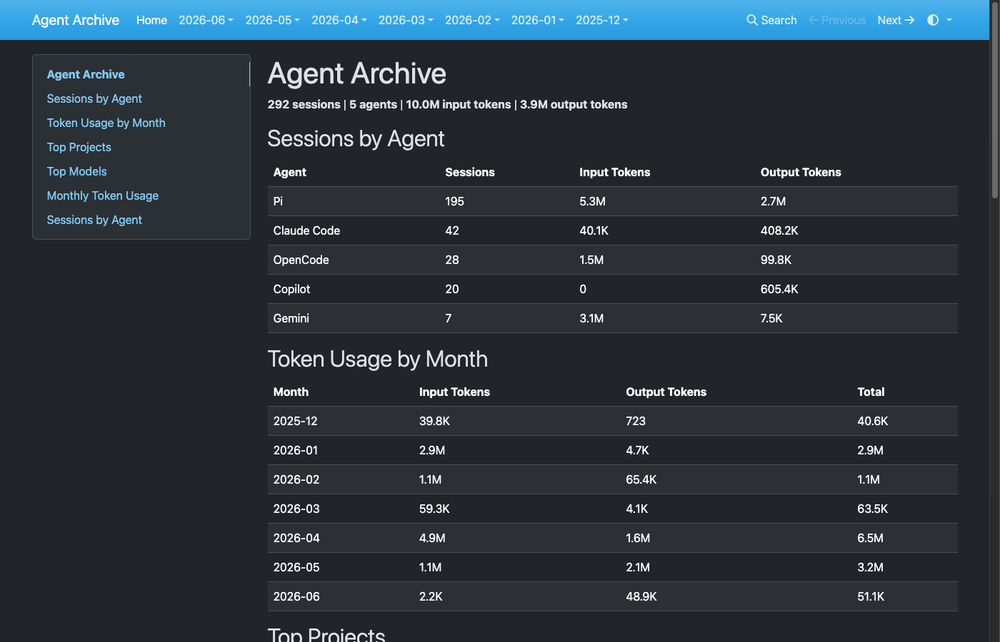

# Agent Archive

Archive and browse agentic coding sessions. Parses session logs from multiple agents and generates a searchable MkDocs static site.



**Supported agents:** Claude Code, Gemini CLI, Pi, OpenCode, GitHub Copilot

## Requirements

- Python 3.10+

## Installation

Install as a standalone CLI with [uv](https://docs.astral.sh/uv/):

```bash
uv tool install agent-archive
```

Or with pip:

```bash
pip install agent-archive
```

For development (from a local clone):

```bash
uv sync
```

## Usage

### Sync

Parse agent logs and generate Markdown files in `~/ai-sessions/docs`:

```bash
agent-archive sync --output ~/ai-sessions
```

Agent log directories are auto-discovered at their default locations. Override any of them:

```bash
agent-archive sync --output ~/ai-sessions \
  --claude-path ~/.claude \
  --pi-path ~/.pi/agent \
  --opencode-db ~/.local/share/opencode/opencode.db \
  --gemini-path ~/.gemini/tmp \
  --copilot-path ~/.copilot
```

Only sessions that have changed since the last sync are re-parsed (incremental).

**Secret redaction** is on by default — API keys, tokens, and env var values are replaced with `REDACTED` in the rendered output. To disable:

```bash
agent-archive sync --output ~/ai-sessions --no-redact
```

### Build

Generate the MkDocs config and build the static HTML site in `~/ai-sessions/site`:

```bash
agent-archive build --output ~/ai-sessions
```

### Serve

Open the archive in a browser:

```bash
agent-archive serve --output ~/ai-sessions
```

This starts a local HTTP server (default port 8000) and opens a browser tab. A server is required because the site uses JavaScript for search.

```bash
agent-archive serve --output ~/ai-sessions --port 9000 --no-browser
```

## Sharing across multiple machines

You can point all your machines at the same output directory synced via Dropbox, Syncthing, or similar. Each machine maintains its own `.sync_state.<hostname>.json` file in the output directory so they never interfere with each other.

On each machine, run sync independently:

```bash
agent-archive sync --output ~/Dropbox/ai-sessions
```

Sessions from all machines accumulate in the shared archive. On any machine where you want to browse, build and serve:

```bash
agent-archive build --output ~/Dropbox/ai-sessions
agent-archive serve --output ~/Dropbox/ai-sessions
```

## Development

Run tests:

```bash
uv run pytest
```

## Project Structure

```
src/agent_archive/
  cli.py              # Typer CLI (sync, serve)
  models.py           # Pydantic models (Session, Message)
  redactor.py         # Secret redaction
  renderer.py         # Markdown + MkDocs site generation
  site_builder.py     # mkdocs.yml config and build
  state.py            # Incremental sync state (per-machine)
  parsers/
    base.py           # Abstract BaseParser
    claude_code.py
    gemini.py
    pi.py
    opencode.py
    copilot.py
```

## Adding a Parser

Subclass `BaseParser` to support a new agent log format:

```python
from pathlib import Path
from agent_archive.parsers.base import BaseParser
from agent_archive.models import Session

class MyAgentParser(BaseParser):
    def discover(self) -> list[Path]:
        # Return all log file paths for this agent
        ...

    def parse(self, filepath: Path) -> list[Session]:
        # Parse the log file and return Session objects
        ...
```
